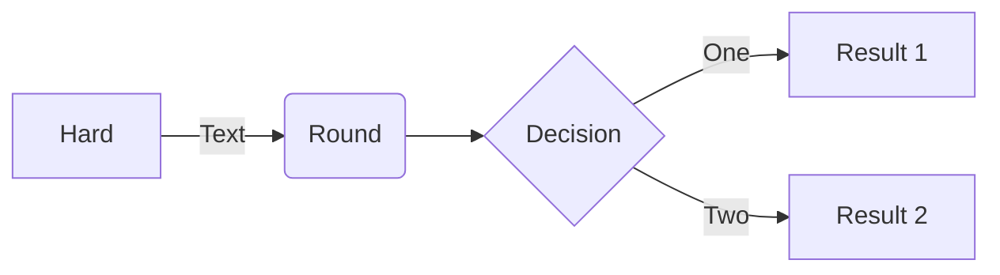
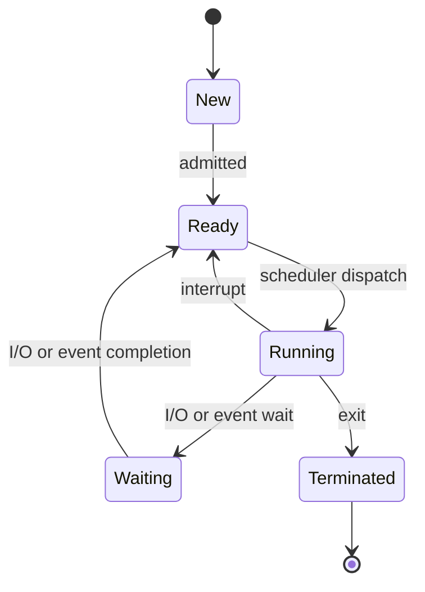

# pr-architecture-guide-lines

DevOps | Repositorio | Roberto Perez






```plantuml
!include <awslib/AWSCommon>
' Uncomment the following line to create simplified view
!include <awslib/AWSSimplified>

!include <awslib/General/Users>
!include <awslib/Mobile/APIGateway>
!include <awslib/SecurityIdentityAndCompliance/Cognito>
!include <awslib/Compute/Lambda>
!include <awslib/Database/DynamoDB>

left to right direction


Users(sources, "Events", "millions of users")
APIGateway(votingAPI, "Voting API", "user votes")
Cognito(userAuth, "User Authentication", "jwt to submit votes")
Lambda(generateToken, "User Credentials", "return jwt")
Lambda(recordVote, "Record Vote", "enter or update vote per user")
DynamoDB(voteDb, "Vote Database", "one entry per user")

sources --> userAuth
sources --> votingAPI
userAuth <--> generateToken
votingAPI --> recordVote
```
