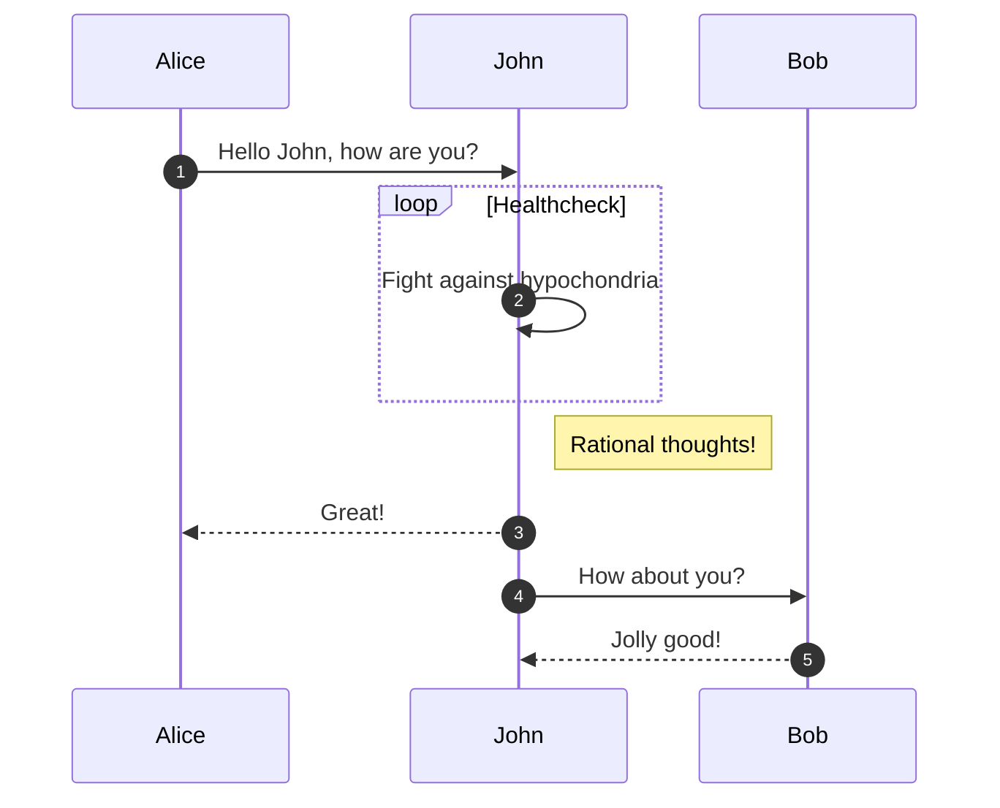
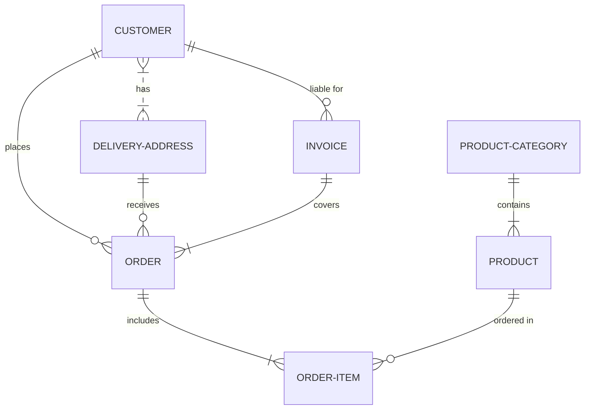

# Arquitectura de software
>*Conjunto de definiciones que proporcionan un marco de referencia necesario para guiar la construcción de un software, permitiendo a los programadores, analistas, testers y todo el conjunto de desarrolladores del software compartir una misma línea de trabajo y cubrir todos los objetivos y restricciones de la aplicación. Es considerada el nivel más alto en el diseño de la arquitectura de un sistema puesto que establecen la estructura, funcionamiento e interacción entre las partes del software.*

El objetivo principal de una arquitectura es asegurar la separación de responsabilidades mediante capas y definiendo reglas de dependencias entre ellas, que permitar desacoplar el dominio de la applicación de la implementación.

## Arquitecturas
1.- Cliente/Servidor
2.- N-Capas 
3.- MVC
4.- Clean
5.- Hexagonal
6.- Onion (Cebolla)

